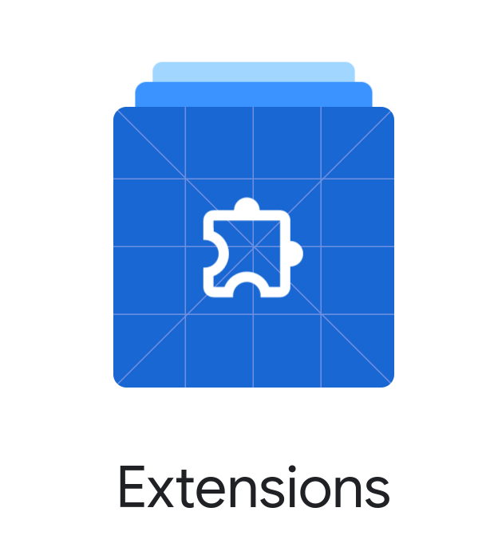

# Chrome Extensions

Extensions are software programs, built on web technologies (such as HTML, CSS, and JavaScript) that enable users to customize the Chrome browsing experience.

https://developer.chrome.com/docs/extensions/

# Getting Started

# Extension Popup

# Set Background Color

# Extension Options

